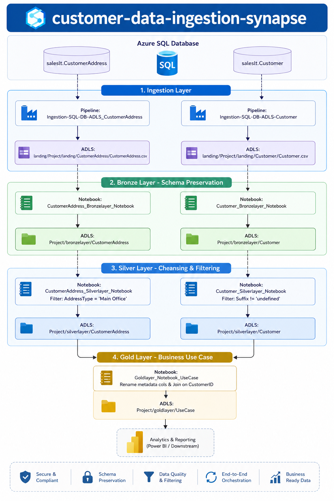

# 🚀 Customer Data Ingestion Synapse

## 📊 Project Overview

End-to-end **Azure Synapse Analytics data engineering pipeline** that ingests customer data from **Azure SQL Database**, processes it through a **Medallion Architecture (Landing → Bronze → Silver → Gold)**, and prepares business-ready datasets for analytics and reporting.

This project demonstrates production-grade cloud data engineering practices including:

* **Medallion Architecture Implementation**
* **Azure Synapse Pipeline Orchestration**
* **Azure Data Lake Storage Gen2 Integration**
* **Schema Preservation & Data Governance**
* **PySpark Data Transformation**
* **Data Cleansing & Filtering**
* **Business Layer Data Modeling**
* **Analytics-Ready Data Preparation**

---

# 🏗️ Architecture


---

# 🛠️ Tech Stack

| Component | Technology |
|-----------|------------|
| Cloud Platform | Microsoft Azure |
| Data Platform | Azure Synapse Analytics |
| Storage | Azure Data Lake Storage Gen2 |
| Source Database | Azure SQL Database |
| Processing Engine | Apache Spark |
| Language | PySpark / Python |
| ETL Orchestration | Azure Synapse Pipelines |
| Data Format | CSV / Delta / Parquet |
| Analytics | Power BI / Downstream Reporting |
| Authentication | Azure Managed Identity |

---

# 📁 Project Structure
customer-data-ingestion-synapse/

│
├── credential/
│ └── WorkspaceSystemIdentity.json
│ # Azure managed identity configuration
│
├── dataset/
│ ├── ADLS_DS.json
│ │ # Azure Data Lake dataset metadata
│ │
│ └── SQL_DB_DS.json
│ # SQL database dataset definition
│
├── linkedService/
│ ├── sql_db_ls.json
│ │ # Azure SQL connection configuration
│ │
│ ├── WorkspaceDefaultStorage.json
│ │ # ADLS connection configuration
│ │
│ └── WorkspaceDefaultSqlServer.json
│ # Synapse SQL configuration
│
├── pipeline/
│
│ ├── Ingestion-SQL-DB-ADLS-Customer.json
│ │ # Customer ingestion pipeline
│ │
│ ├── Ingestion-SQL-DB-ADLS-CustomerAddress.json
│ │ # Customer address ingestion pipeline
│ │
│ ├── BronzeLayer_Customer.json
│ │
│ ├── BronzeLayer_CustomerAddress.json
│ │
│ ├── SilverLayer_Customer.json
│ │
│ ├── SilverLayer_CustomerAddress.json
│ │
│ └── GoldLayer_UseCase.json
│
├── notebook/

│ ├── Customer_Bronzelayer_Notebook
│ │ # Bronze processing logic
│
│ ├── CustomerAddress_Bronzelayer_Notebook
│
│ ├── Customer_Silvelayer_Notebook
│ │ # Customer cleansing logic
│
│ ├── CustomerAddress_Silverlayer_Notebook
│
│ └── Goldlayer_Notebook_UseCase
│ # Business transformation logic
│
├── sqlscript/
│ # SQL objects/scripts

└── publish_config.json
# Synapse deployment configuration

---

# 📚 Pipeline Stages

# 🟦 Stage 1: Ingestion Layer

**Purpose:** Extract operational customer data from Azure SQL Database and load into Azure Data Lake Storage.

## Source Tables
saleslt.Customer

saleslt.CustomerAddress

## Synapse Pipelines
SQL Database
|
|
Copy Activity
|
|
ADLS Landing Zone

## Output
landing/

Project/
landing/
  Customer/
      Customer.csv

  CustomerAddress/
      CustomerAddress.csv
      
---

# 🟤 Stage 2: Bronze Layer - Schema Preservation

**Purpose:** Preserve source data structure before applying transformations.

## Processing

Operations:

* Read landing files
* Maintain original schema
* Store raw processed datasets
* Create historical data foundation


Flow:
Landing Data

  ↓

Bronze Notebook

  ↓

ADLS Bronze Storage

Output:
Project/bronzelayer/

├── Customer

└── CustomerAddress

---

# ⚪ Stage 3: Silver Layer - Cleansing & Filtering

**Purpose:** Transform raw datasets into clean analytical datasets.

## Customer Address Processing

Operations:

* Filter valid address records
* Keep main office addresses

Example:

```python
AddressType = 'Main Office'

Customer Processing

Operations:

Remove invalid records
Apply filtering rules
Prepare structured customer data

Flow:
Bronze Data

      ↓

Silver Notebook

      ↓

Cleaned ADLS Dataset

Output:
Project/silverlayer/

├── Customer

└── CustomerAddress

🟡 Stage 4: Gold Layer - Business Use Case

Purpose: Create business-ready datasets for analytics consumption.

Processing

Operations:

Join customer and customer address datasets
Rename metadata columns
Prepare final reporting dataset

Flow:
Silver Customer Data

        +

Silver Address Data

        ↓

Gold Transformation

        ↓

Business Dataset

Output:
Project/goldlayer/UseCase

🔄 Automated Workflow
Pipeline Execution Order

1. Customer Ingestion
          |
          ▼

2. Customer Address Ingestion
          |
          ▼

3. Bronze Processing
          |
          ▼

4. Silver Transformation
          |
          ▼

5. Gold Business Processing
          |
          ▼

6. Analytics Reporting

🔐 Data Flow Architecture

flowchart TD

A[Azure SQL Database]

B[Synapse Pipeline]

C[ADLS Landing]

D[Bronze Layer]

E[Silver Layer]

F[Gold Layer]

G[Power BI Analytics]


A --> B

B --> C

C --> D

D --> E

E --> F

F --> G


📊 Database Design
Source Entities
erDiagram


CUSTOMER {

}


CUSTOMER_ADDRESS {

}


CUSTOMER ||--o{ CUSTOMER_ADDRESS : contains

🚀 Setup Instructions
Prerequisites

Required:

Azure Subscription
Azure Synapse Workspace
Azure Data Lake Storage Gen2
Azure SQL Database
Required Azure permissions

Step 1: Clone Repository
git clone <repository-url>

cd customer-data-ingestion-synapse

Step 2: Configure Azure Resources
Create:
Azure SQL Database

Azure Synapse Workspace

ADLS Gen2 Storage Account

Step 3: Import Synapse Components
Import:
datasets/

linkedService/

pipelines/

notebooks/

credentials/
into Synapse Studio.

Step 4: Configure Connections

Update:
linkedService/

with:
SQL server details
Database name
Storage account information
Authentication settings

Step 5: Execute Pipeline

Run in order:
Ingestion

↓

Bronze

↓

Silver

↓

Gold

Analytics Dashboard

Add:
c:\Users\priya\Desktop\powerBi.png

🎯 Data Engineering Best Practices Demonstrated

✅ Medallion Architecture
✅ Layer-based data processing
✅ Schema preservation
✅ Separation of ingestion and transformation logic
✅ Azure-native orchestration
✅ Secure cloud authentication
✅ Modular notebook design
✅ Scalable data lake architecture
✅ Business-ready data modeling


⚡ Challenges & Solutions
Challenge: Handling Raw Source Data Changes

Solution:

Implemented Bronze layer to preserve incoming source structure before transformations.

Challenge: Maintaining Data Quality

Solution:

Implemented Silver cleansing layer with filtering rules.

Challenge: Building Analytics Ready Data

Solution:

Created Gold layer with business-specific transformations.

🔮 Future Enhancements
Incremental loading using watermark strategy
Metadata-driven ingestion framework
Automated data quality framework
Azure DevOps CI/CD deployment
Data lineage implementation
Delta Lake optimization
Pipeline monitoring and alerting
Real-time streaming ingestion

🤝 Contributing

Contributions are welcome.

Steps:
git checkout -b feature/new-feature

git commit -m "Add new feature"

git push origin feature/new-feature

Create a Pull Request with:

Description
Technical changes
Testing details

👨‍💻 Author
Project Maintainer

Name: Priya Ramteke

Role: Data Engineer

GitHub:https://github.com/PriyaRamteke
LinkedIn: https://www.linkedin.com/in/priyaborkar10/